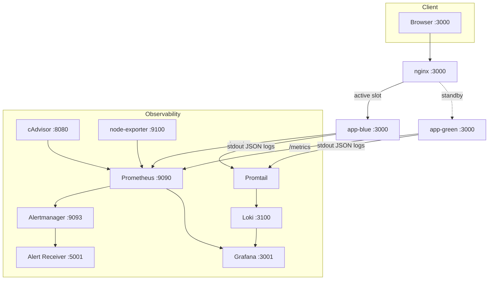
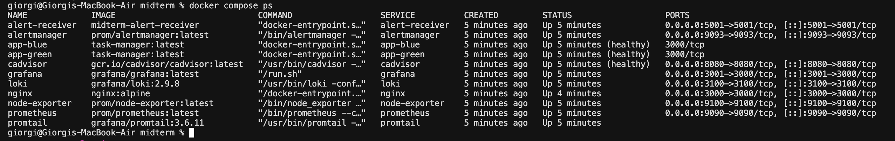
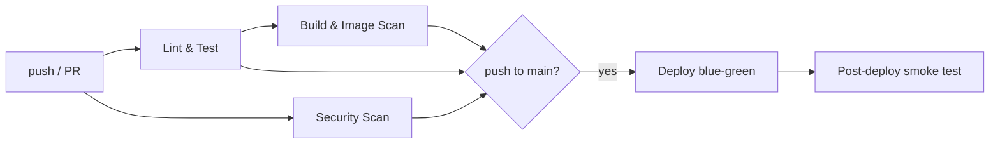
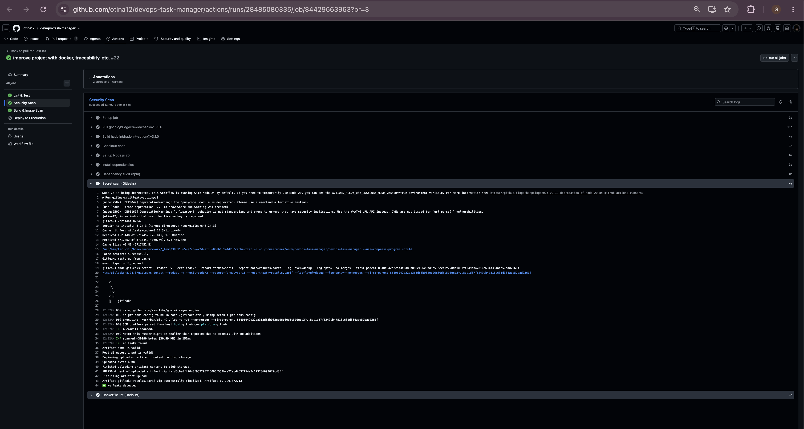
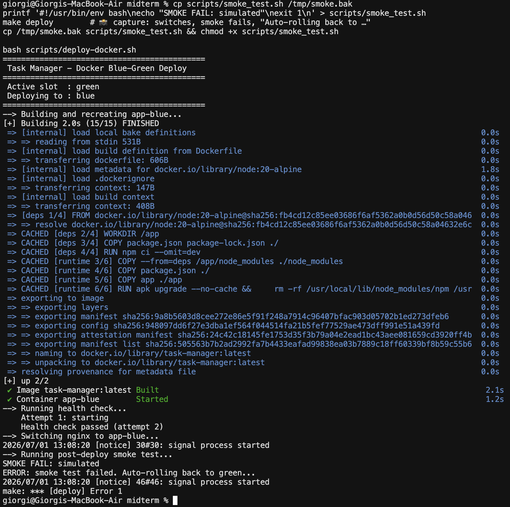
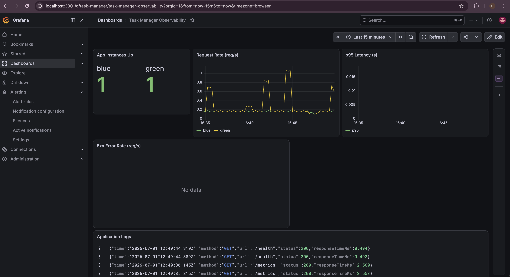
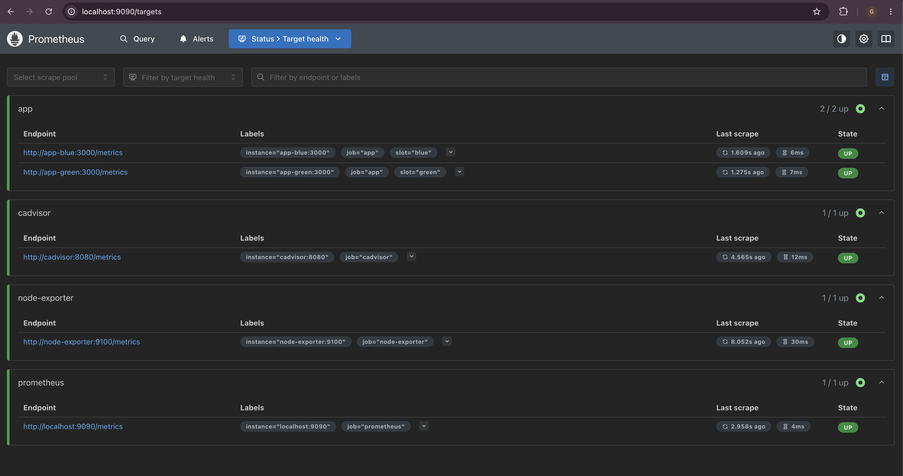
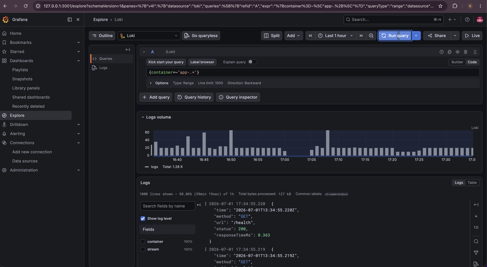
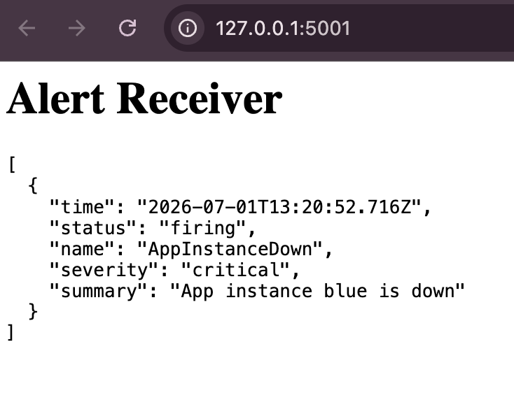
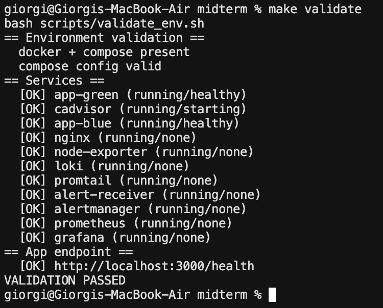

# Task Manager — DevOps Final Project

A small task-management web app used as the vehicle for a full, production-style DevOps
workflow: version control, CI/CD, Infrastructure as Code, containerization, blue-green
deployments, security automation, monitoring, logging, observability, alerting, and
reliability engineering.

The app itself is intentionally simple — the value is in the automation and operations
around it. **Everything runs locally with a single command** (`make up`) via Docker
Compose, and is reproducible on any machine with Docker.

---

## Tech Stack

| Category | Tool |
|---|---| 
| Web App | Node.js 20 + Express 4 |
| Frontend | HTML, CSS, Vanilla JS |
| Tests / Lint | Jest + Supertest / ESLint |
| Containerization | Docker + Docker Compose |
| CI/CD | GitHub Actions |
| IaC / Automation | Ansible + Makefile |
| Reverse Proxy | nginx |
| Process Manager (VM path) | PM2 |
| Deployment Strategy | Blue-Green (Docker **and** VM) |
| Metrics | prom-client + Prometheus |
| Dashboards | Grafana |
| Logging | morgan (JSON) → Promtail → Loki |
| Infra Metrics | cAdvisor + node-exporter |
| Alerting | Prometheus Alertmanager → local webhook receiver |
| Security | Trivy, Gitleaks, Hadolint, Checkov, npm audit |

---

## Architecture



Two identical app **slots** (blue / green) run side by side. nginx proxies port 3000 to the
active slot. Deployments go to the standby slot, get health-checked and smoke-tested, and
only then does nginx switch over — the old slot stays running for instant rollback.

---

## Repository Structure

```
├── app/
│   ├── server.js              # Express entry: /health, /metrics, JSON logging
│   ├── metrics.js             # prom-client registry + middleware
│   ├── db.js                  # In-memory task store
│   ├── routes/tasks.js        # CRUD routes
│   └── public/                # Static frontend
├── Dockerfile                 # Multi-stage, non-root, hardened
├── docker-compose.yml         # Full stack: app x2 + nginx + observability
├── Makefile                   # up / down / deploy / rollback / validate / smoke / urls
├── nginx/
│   ├── conf.d/app.conf        # Docker reverse-proxy (switchable upstream)
│   └── app.conf.j2            # Ansible/VM nginx template
├── monitoring/
│   ├── prometheus/            # prometheus.yml + alert.rules.yml
│   ├── alertmanager/          # routing to local receiver
│   ├── alert-receiver/        # tiny self-contained webhook receiver
│   ├── grafana/               # provisioned datasources + dashboard
│   ├── loki/ + promtail/      # log aggregation
├── scripts/
│   ├── deploy-docker.sh       # Docker blue-green + smoke + auto-rollback
│   ├── rollback-docker.sh     # Docker rollback
│   ├── deploy.sh / rollback.sh# VM (PM2) blue-green (original path)
│   ├── smoke_test.sh          # Functional post-deploy verification
│   ├── validate_env.sh        # Environment validation
│   └── health_check.sh        # Periodic health monitor
├── ansible/                   # IaC: provisions Node, PM2, nginx, Docker
├── docs/
│   ├── SLO.md                 # Service level objectives
│   └── RUNBOOK.md             # Incident response
└── .github/workflows/main.yml # CI/CD: test + security + build + deploy
```

---

## Quick Start (Docker — one command)

**Prerequisite:** Docker + Docker Compose v2. That's it.

```bash
make up          # build + start the entire stack
make urls        # print all endpoints
make validate    # confirm every service is healthy
make smoke       # functional check (create → list → toggle → delete)
```

| Service | URL |
|---|---|
| App | http://localhost:3000 |
| Grafana | http://localhost:3001 (admin / admin) |
| Prometheus | http://localhost:9090 |
| Alertmanager | http://localhost:9093 |
| Alert receiver | http://localhost:5001 |
| cAdvisor | http://localhost:8080 |

Tear down with `make down`.



---

## Environment Setup

The project supports two fully-automated environments. **Both are kept operational.**

### A) Docker Compose (recommended, reproducible)

Single command, no host configuration, works on any machine with Docker:

```bash
make up
```

This builds the app image, starts both app slots behind nginx, and brings up the full
observability stack. `make validate` confirms readiness.

### B) Ansible provisioning + self-hosted runner (production-style VM)

The original path, for deploying onto a Linux host (e.g. an Ubuntu VM / WSL2). One command
provisions everything (Node 20, PM2, nginx, Docker):

```bash
ansible-playbook ansible/setup.yml -i ansible/inventory.ini --ask-become-pass
```


A GitHub Actions **self-hosted runner** on the host then deploys on every push to `main`.

---

## CI/CD Pipeline



| Job | Runs on | What |
|---|---|---|
| **Lint & Test** | ubuntu-latest | ESLint + Jest (every push/PR) |
| **Security Scan** | ubuntu-latest | npm audit, Gitleaks, Hadolint, Trivy (fs), Checkov |
| **Build & Image Scan** | ubuntu-latest | `docker build` + Trivy image scan |
| **Deploy** | self-hosted | blue-green deploy on push to `main`, gated on all above |
| **Smoke test** | self-hosted | functional verification after deploy |




### Git Workflow

- `main` — production. Every push runs the full pipeline including deployment.
- `dev` — development. CI (lint + test + security + build) runs; no deployment.

Feature work goes on `dev` / feature branches, is reviewed via PR, and merges to `main`.

---

## Deployment Workflow — Blue-Green

The app runs in two slots: **blue** and **green**. nginx routes to the active one;
`deploy/active_slot` tracks which is live.

```
[Browser :3000] → nginx → app-blue   (active)
                       ↘  app-green  (standby, ready for rollback)
```

### Deploy (Docker)

```bash
make deploy
```

1. Build + recreate the **standby** slot with the new code.
2. Wait for its container **health check** to pass.
3. Switch nginx to the new slot.
4. Run a **post-deploy smoke test** through :3000.
5. If the smoke test fails → **automatic rollback** to the previous slot.

<table><tr>
<td></td>
<td></td>
</tr></table>

### Rollback

```bash
make rollback
```

Instantly switches nginx back to the previous slot — no restart, since it never stopped.




> The original **VM path** (`scripts/deploy.sh` / `rollback.sh` via PM2) remains fully
> functional and is used by the self-hosted runner. See `screenshots/runner_deploying.png`.

---

## Security Implementation

Security checks are integrated into the CI/CD pipeline (all free, open-source tools):

| Tool | Scans for | Gate |
|---|---|---|
| **npm audit** | vulnerable dependencies | fails on HIGH (prod deps) |
| **Gitleaks** | secrets in code + git history | fails on any leak |
| **Hadolint** | Dockerfile best-practices | fails on errors |
| **Trivy (fs)** | vulns, secrets, misconfig in the repo | fails on HIGH/CRITICAL |
| **Trivy (image)** | vulns in the built image | fails on HIGH/CRITICAL |
| **Checkov** | IaC misconfig (Ansible + Compose) | advisory (report) |

**Image hardening:** multi-stage build, **non-root** runtime user, npm/npx stripped from the
final image (smaller attack surface), and `apk upgrade` so OS packages self-patch on every
build. `--ignore-unfixed` keeps gating meaningful.

**Secrets management:** the app is configured only through environment variables; `.env` is
gitignored; `.env.example` documents required variables; CI uses GitHub Secrets. No secrets
in the image or repository (enforced by Gitleaks + Trivy).

---

## Monitoring, Logging & Observability

### Metrics
Each app instance exposes Prometheus metrics at `/metrics` (via `prom-client`): default
process metrics plus `http_requests_total` and `http_request_duration_seconds` (labelled by
method, route, status). Prometheus scrapes both slots.

### Dashboards
Grafana is auto-provisioned (datasources + dashboard) — request rate, p95 latency, 5xx rate,
instance up-status, and live logs.




### Logging
The app emits **structured JSON request logs** to stdout (morgan). Promtail ships all
container logs to **Loki**, queryable in Grafana (`{container=~"app-.+"}`).



### Infrastructure metrics
**cAdvisor** (per-container CPU/memory/network) and **node-exporter** (host metrics) are
scraped by Prometheus.

### Health checks
- App: `/health` endpoint.
- Containers: Docker `HEALTHCHECK`; nginx waits for healthy upstreams.
- `scripts/health_check.sh` polls `/health` every 60s and logs to a file.


---

## Alerting

Prometheus alert rules (`monitoring/prometheus/alert.rules.yml`) route through Alertmanager
to a **self-contained local webhook receiver** (no external account needed):

| Alert | Condition |
|---|---|
| `AppInstanceDown` | an instance fails health scrapes for 30s |
| `HighErrorRate` | 5xx rate above threshold for 1m |
| `HighLatencyP95` | p95 latency > 200ms for 2m |

**Demo:** stop a slot and watch the alert fire end-to-end:
```bash
docker stop app-green
# ~1 min later: AppInstanceDown appears at http://localhost:5001
docker start app-green
```



---

## Reliability Improvements

- **Deployment verification** — every deploy is health-checked and smoke-tested before it's
  considered done.
- **Automatic rollback** — a failed smoke test reverts traffic to the previous slot with no
  manual action.
- **Instant manual rollback** — the standby slot is always kept running.
- **Self-healing** — `restart: unless-stopped` on all containers; health-check-gated nginx.
- **Environment validation** — `make validate` confirms every service is healthy.
- **[Service Level Objectives](docs/SLO.md)** — availability, latency, and error-rate targets
  with error budget and PromQL definitions.
- **[Incident Runbook](docs/RUNBOOK.md)** — response procedures for each alert, plus rollback
  and full-recovery steps.



---

## Testing & Linting

```bash
make test        # Jest + Supertest
make lint        # ESLint
```
