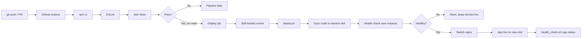
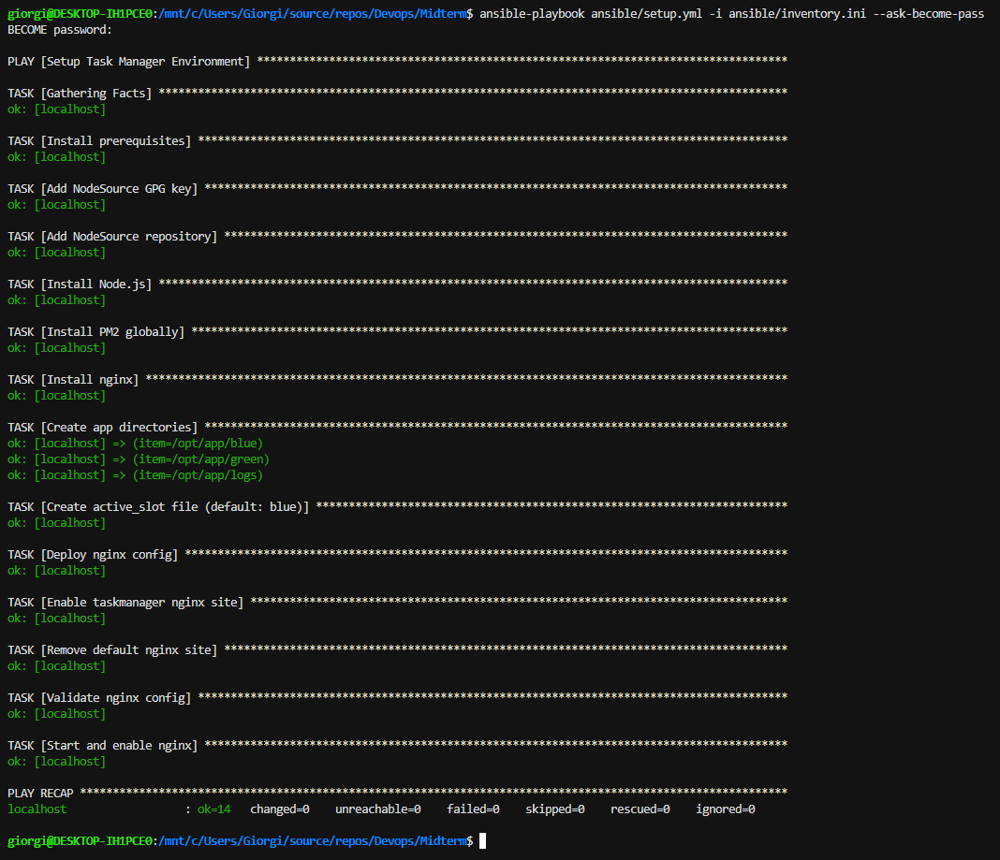
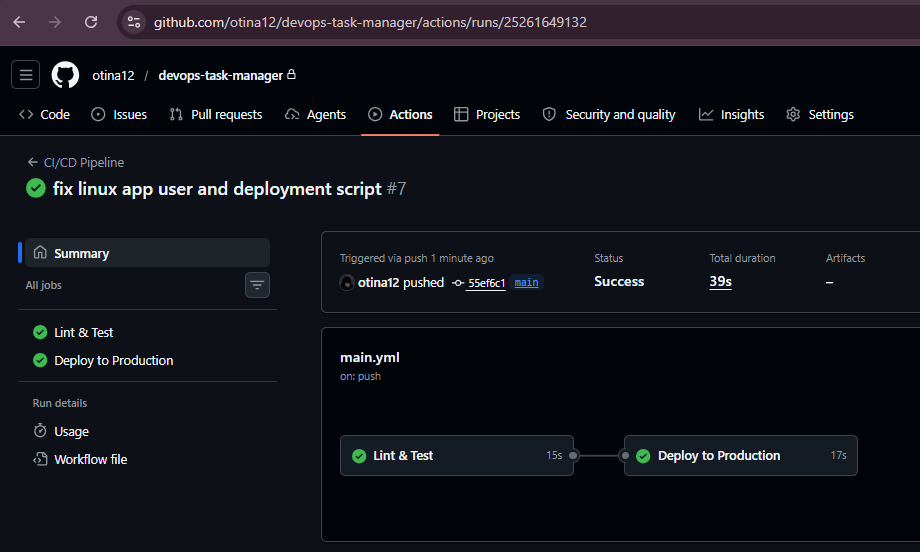
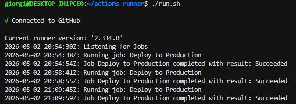
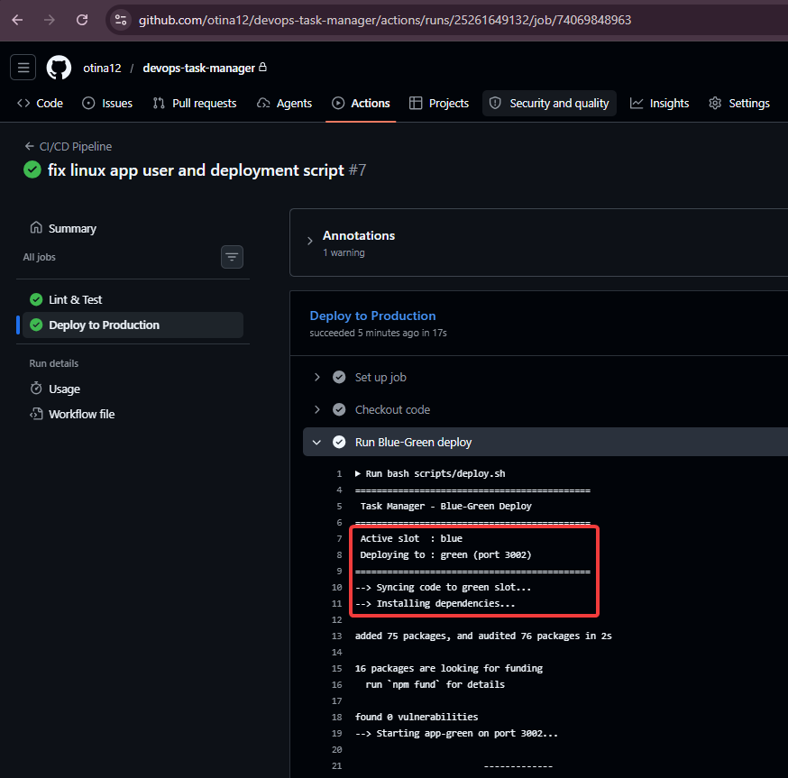
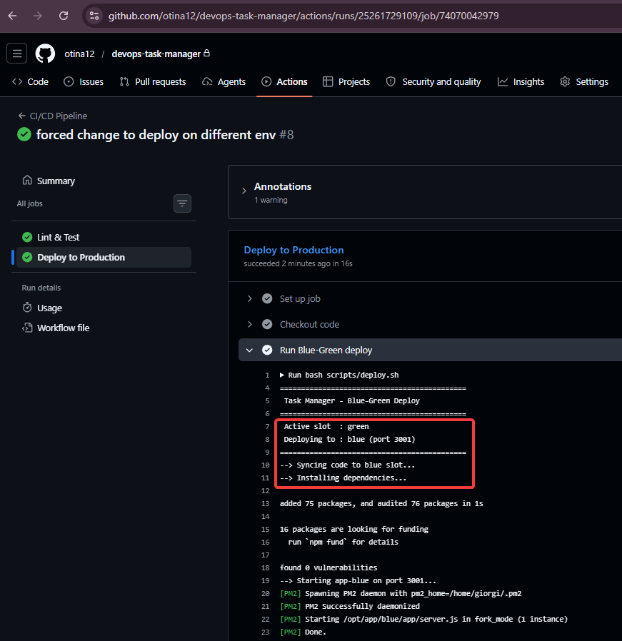
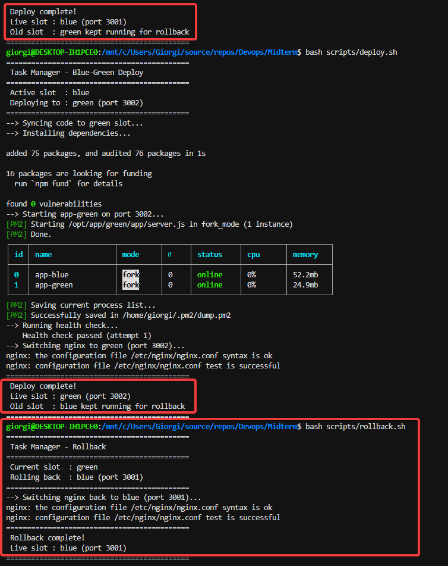
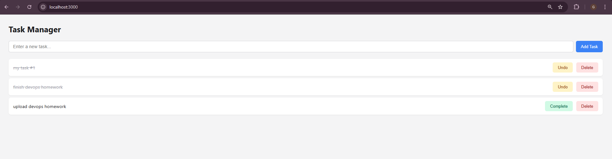
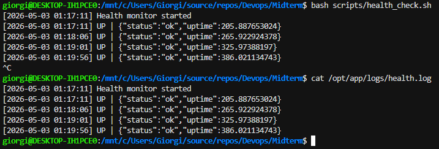

# Task Manager — DevOps Practice Project

A small task management web app built to practice a full DevOps workflow: version control, CI/CD pipelines, infrastructure automation, blue-green deployments, and health monitoring.

---

## Tech Stack

| Category | Tool |
|---|---|
| Web App | Node.js 20 + Express 4 |
| Frontend | HTML, CSS, Vanilla JS |
| Tests | Jest + Supertest |
| Linting | ESLint |
| CI/CD | GitHub Actions |
| IaC | Ansible |
| Process Manager | PM2 |
| Reverse Proxy | nginx |
| Deployment Strategy | Blue-Green |
| Monitoring | Bash + curl |
| Runtime Environment | WSL2 (Ubuntu) |

---

## CI/CD Workflow



---

## Project Structure

```
├── app/
│   ├── server.js          # Express entry point + /health endpoint
│   ├── db.js              # In-memory task store
│   ├── routes/tasks.js    # CRUD routes
│   └── public/            # Static frontend (HTML, CSS, JS)
├── tests/
│   └── tasks.test.js      # Jest + Supertest unit tests
├── ansible/
│   ├── setup.yml          # Ansible playbook
│   └── inventory.ini      # Targets localhost
├── nginx/
│   └── app.conf.j2        # nginx config template
├── scripts/
│   ├── deploy.sh          # Blue-Green deploy
│   ├── rollback.sh        # Instant rollback
│   └── health_check.sh    # Periodic health monitor
└── .github/workflows/
    └── main.yml           # CI/CD pipeline
```

---

## Prerequisites

- Git
- Node.js 20 + npm (handled by Ansible)
- Ansible (`sudo apt install ansible`)
- WSL2 with Ubuntu (on Windows) or any Linux machine
- A GitHub account with a repository

---

## Setup & Deployment Guide

### 1. Clone the repository

```bash
git clone https://github.com/otina12/devops-task-manager.git
cd devops-task-manager
```

### 2. Install dependencies (local development)

```bash
npm install
```

Run tests:
```bash
npm test
```

Run linter:
```bash
npm run lint
```

### 3. Run the Ansible playbook

This installs Node.js 20, PM2, and nginx, and creates the directory structure under `/opt/app`.

```bash
ansible-playbook ansible/setup.yml -i ansible/inventory.ini --ask-become-pass
```

Enter your sudo password when prompted. The playbook is idempotent — safe to run multiple times.



### 4. Set up the GitHub Actions self-hosted runner

Go to your GitHub repo → **Settings → Actions → Runners → New self-hosted runner**, select Linux, and follow the generated commands. Then start the runner:

```bash
cd ~/actions-runner
./run.sh
```

To keep it running across reboots:
```bash
sudo ./svc.sh install
sudo ./svc.sh start
```

### 5. Push to trigger the pipeline

Any push to `main` triggers the full CI/CD pipeline: lint → test → deploy.

```bash
git add .
git commit -m "feat: initial deployment"
git push origin main
```





---

## Blue-Green Deployment

The app runs in two identical slots — **blue** (port 3001) and **green** (port 3002). nginx listens on port 3000 and proxies to whichever slot is active. Deployments go to the inactive slot first, get health-checked, and only then does nginx switch over. The old slot stays running until the next deploy, making rollback instant.

```
[Browser :3000] → nginx → blue  :3001
                       OR green :3002

/opt/app/active_slot  →  tracks which is live
```

### Deploy manually

```bash
bash scripts/deploy.sh
```

<table><tr>
<td></td>
<td></td>
</tr></table>

### Rollback

If something is wrong after a deploy, switch back to the previous slot immediately:

```bash
bash scripts/rollback.sh
```

No restart required — the old slot never stopped running.



### App running



---

## Health Monitoring

A background script polls `/health` every 60 seconds and appends a timestamped entry to `/opt/app/logs/health.log`.

```bash
# Start in background
bash scripts/health_check.sh &

# View logs
cat /opt/app/logs/health.log
```

Example output:
```
[2026-05-03 01:15:00] Health monitor started
[2026-05-03 01:15:00] UP | {"status":"ok","uptime":84.3}
[2026-05-03 01:16:00] UP | {"status":"ok","uptime":144.7}
```



---

## Git Workflow

Two permanent branches:

- `main` — production. Every push triggers the full CI/CD pipeline including deployment.
- `dev` — development. CI runs (lint + test) but no deployment.

Feature work goes on `dev` or a feature branch, gets reviewed via PR, and merges into `main` to deploy.

```bash
git checkout dev
# make changes
git add .
git commit -m "feat: add task filtering"
git push origin dev
# open PR → dev → main
```
